# Sistema de Gestión Integral – La Barra Village 🏋️‍♂️

Plataforma web Full-Stack desarrollada a medida para la administración digital, control de accesos y reserva de clases del gimnasio exclusivo de un barrio cerrado. 

El sistema centraliza la operación del espacio logrando prescindir de registros manuales y optimizando la convivencia comunitaria. Actualmente se encuentra en producción con **~165 usuarios activos** en sus primeros días de lanzamiento.

  <b>Portal de Acceso / Inicio de Sesión</b> 
  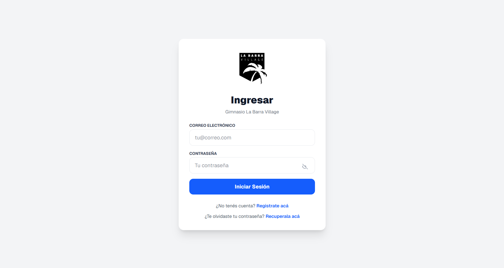

---

## 🚀 Funcionalidades Principales

### 📱 Módulo de Usuarios / Residentes
- **Acceso Inteligente por QR:** Registro automatizado de entradas y salidas de las instalaciones mediante el escaneo de códigos QR individuales desde el dispositivo móvil.
- **Rutinas Digitales:** Consulta y seguimiento de planes de entrenamiento personalizados directamente desde la app, eliminando por completo el uso de las tradicionales fichas físicas de papel.
- **Concurrencia en Tiempo Real:** Visualización en vivo del aforo actual del gimnasio para que los residentes puedan planificar su visita y evitar horarios de alta densidad.
- **Cronograma y Reservas:** Consulta del calendario semanal de clases y sistema de reserva de cupos para optimizar la capacidad del lugar.
- **Gestión de Invitados:** Módulo para pre-autorizar el ingreso de visitas temporales a las instalaciones de forma segura.

### 💼 Módulo de Administración, Auditoría y Analíticas
- **Asignación y Gestión de Rutinas:** Panel técnico para que los profesores/administradores creen, editen y asignen planes de entrenamiento digitales a los perfiles de los usuarios de forma personalizada.
- **Control Global de Usuarios y Clases:** Altas, bajas y modificación de perfiles de residentes autorizados, junto con la gestión de horarios y cupos disponibles.
- **Asistencia Automatizada:** Toma de asistencia automática a las clases en base a las reservas vigentes y los registros de acceso.
- **Centro de Avisos y Novedades:** Canal de comunicación directa dentro de la app para notificar de manera inmediata cambios de horarios, reformas o noticias importantes.
- **Métricas y Business Intelligence:** Panel estadístico que procesa los datos de uso del gimnasio en tiempo real, permitiendo visualizar:
  - Tiempo de permanencia promedio por usuario.
  - Concurrencia simultánea máxima alcanzada.
  - Cantidad de personas promedio por día.
  - Distribución y porcentajes de usuarios que entrenan en sala de musculación vs. los que asisten a clases guiadas.
- **Exportación de Datos (Auditoría):** Motor de descargas que permite extraer el historial completo de entradas/salidas y reservas en formato `.csv` para su posterior análisis y auditoría externa.

---

## ⚙️ Arquitectura de Negocio Especializada
> **Nota de Diseño:** A diferencia de un gimnasio comercial convencional, el sistema está adaptado a las dinámicas de un barrio privado. Toda la gestión de cobros y membresías es gestionada de manera externa mediante las expensas de la administración central. Esto permitió enfocar la arquitectura del software puramente en la **experiencia de usuario (UX), la digitalización de procesos (rutinas y accesos), la analítica de datos y la optimización operativa de los espacios comunes.**

---

## 🛠️ Stack Tecnológico
- **Frontend / Framework:** Next.js (React) con arquitectura basada en componentes eficientes.
- **Estilos:** Tailwind CSS para una interfaz moderna, limpia y completamente responsive (Mobile-First).
- **Backend & Base de Datos:** Supabase (PostgreSQL) para el modelado relacional de datos, persistencia, procesamiento de agregaciones estadísticas y autenticación robusta.
- **Despliegue:** Vercel, garantizando alta disponibilidad y estabilidad en producción.

---

## 📸 Vista Previa del Sistema

### 📱 Experiencia del Residente (Mobile-First)
Para garantizar la comodidad del usuario, toda la interfaz del cliente fue diseñada y optimizada para dispositivos móviles en una cuadrícula simétrica.

<table>
  <tr>
    <td width="33.3%">
<b>Menú Lateral</b>
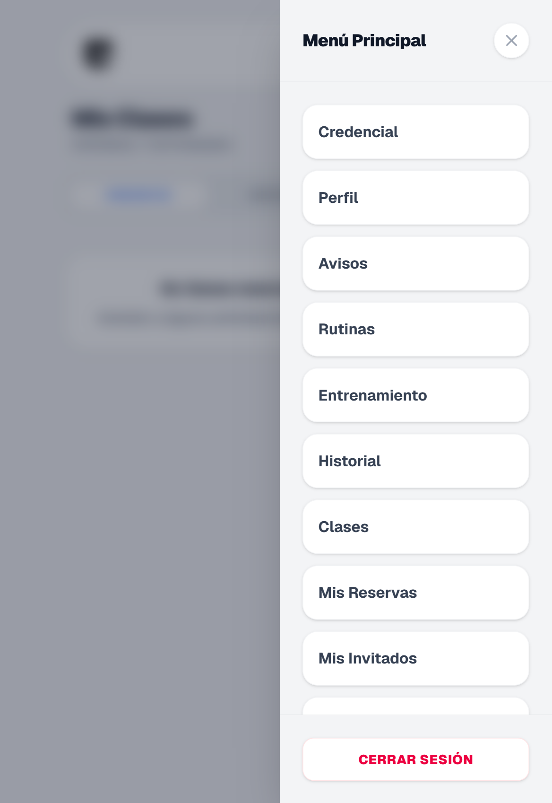</td>
    <td width="33.3%">
<b>Dashboard y QR</b>
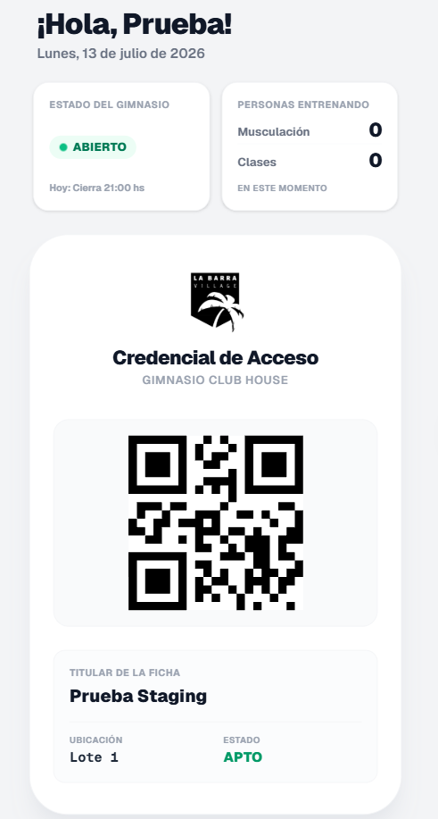</td>
    <td width="33.3%">
<b>Perfil de Usuario</b>
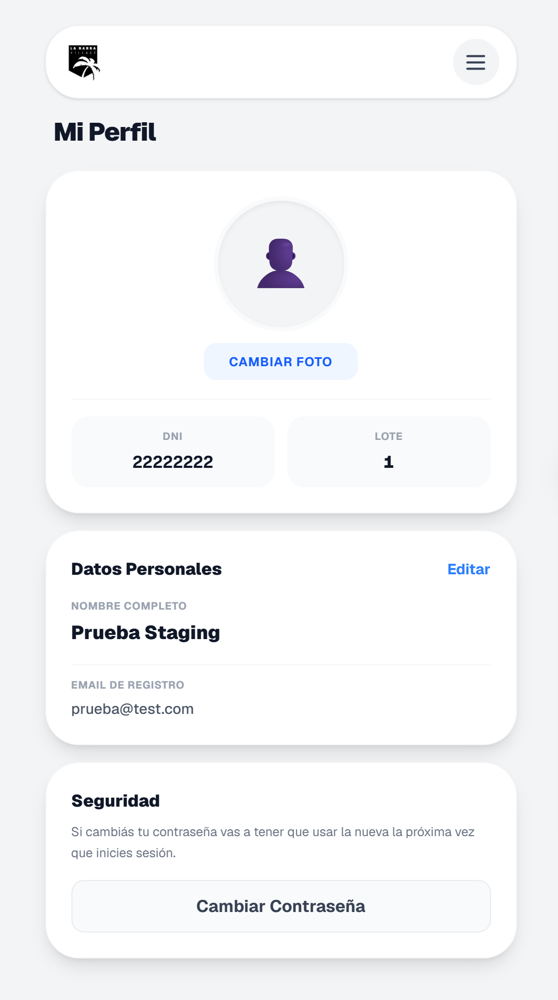</td>
  </tr>
  <tr>
    <td>
<b>Reserva de Clases</b>
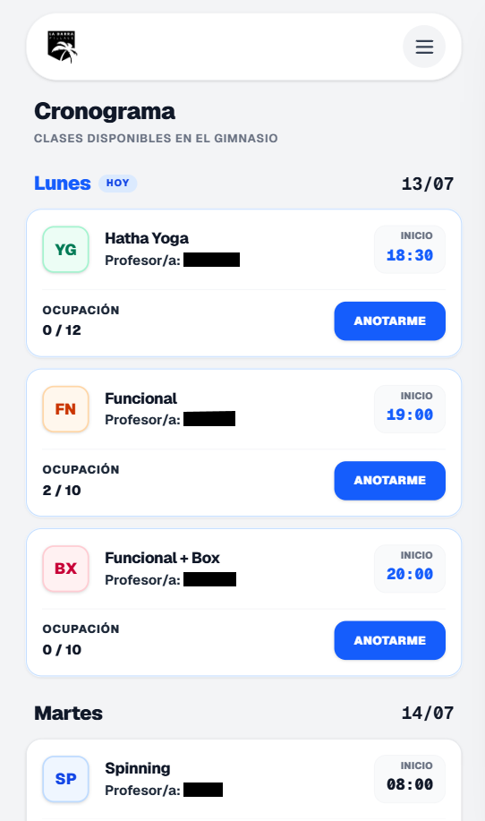</td>
    <td>
<b>Listado de Rutinas</b>
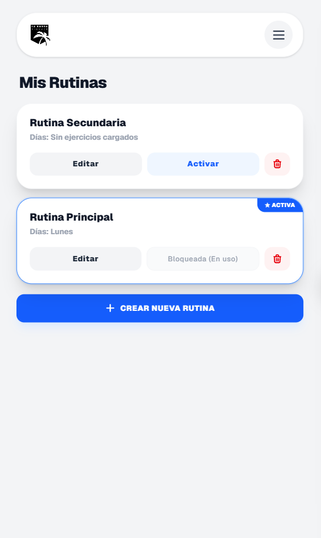</td>
    <td>
<b>Detalle de Ejercicio</b>
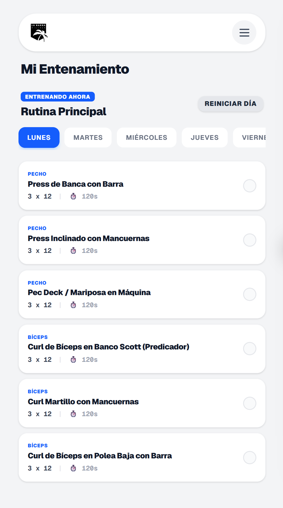</td>
  </tr>
</table>

 

  <b>Historial Personal de Accesos (Vista Móvil)</b> 
  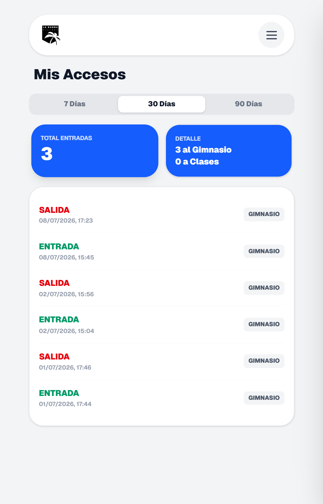

---

### 💼 Panel de Administración, Analíticas y Gestión (Desktop)
Vistas del panel de control web utilizado por los profesores y la administración para monitorear el gimnasio, gestionar rutinas y auditar los datos.

  <b>Panel de Control Principal (Administración General)</b> 
  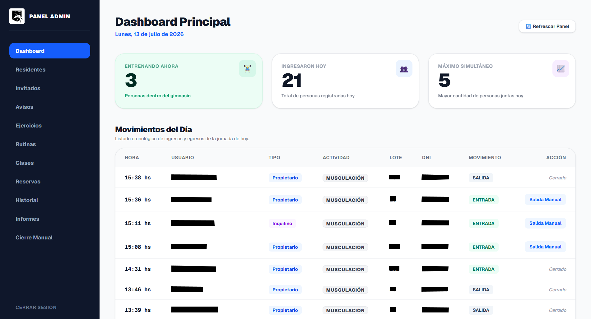

 

<table>
  <tr>
    <td width="50%">
      
<b>Dashboard de Informes y Estadísticas (Aforo)</b>

      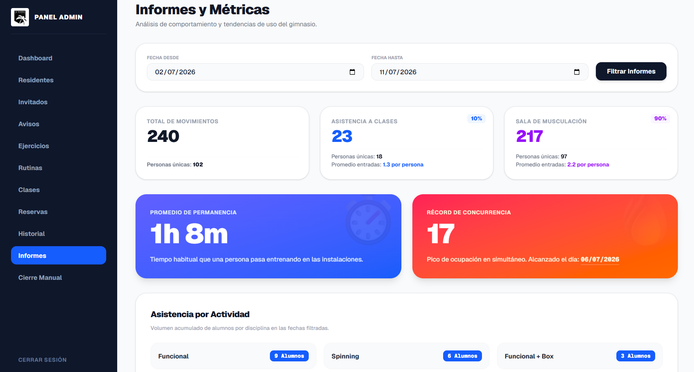
    </td>
    <td width="50%">
      
<b>Distribución de Entrenamiento y Permanencia</b>

      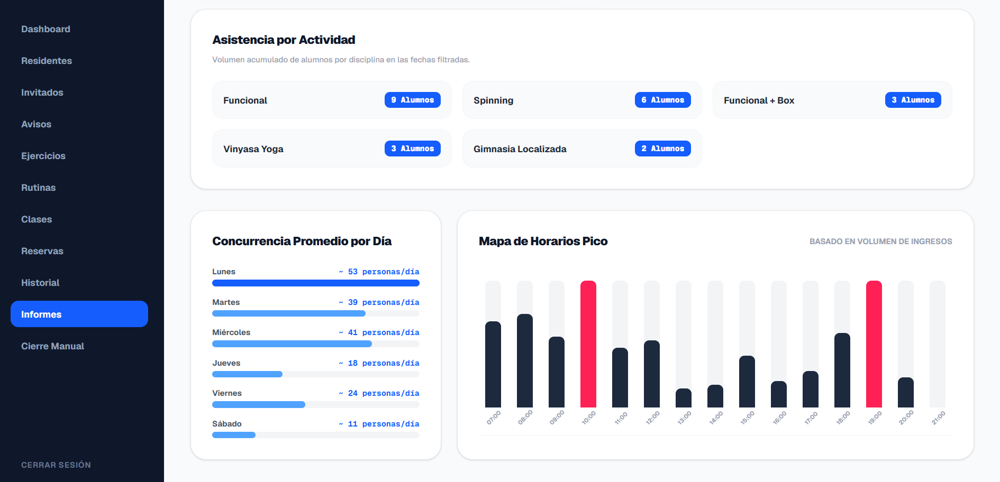
    </td>
  </tr>
  <tr>
    <td>
      
<b>Control y Auditoría de Residentes</b>

      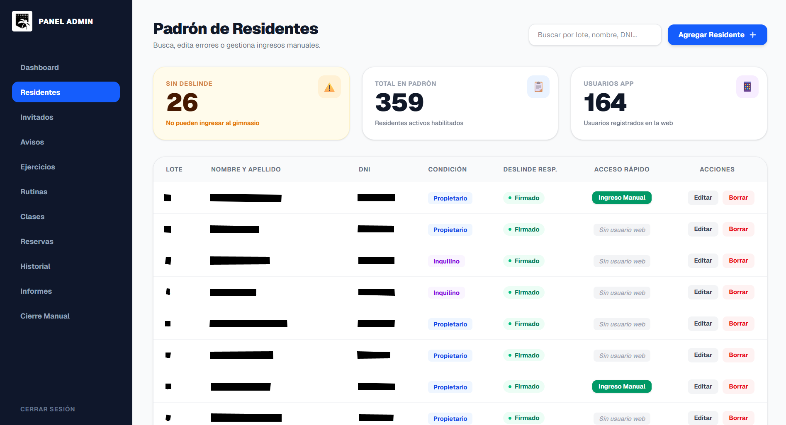
    </td>
    <td>
      
<b>Historial General de Entradas y Salidas</b>

      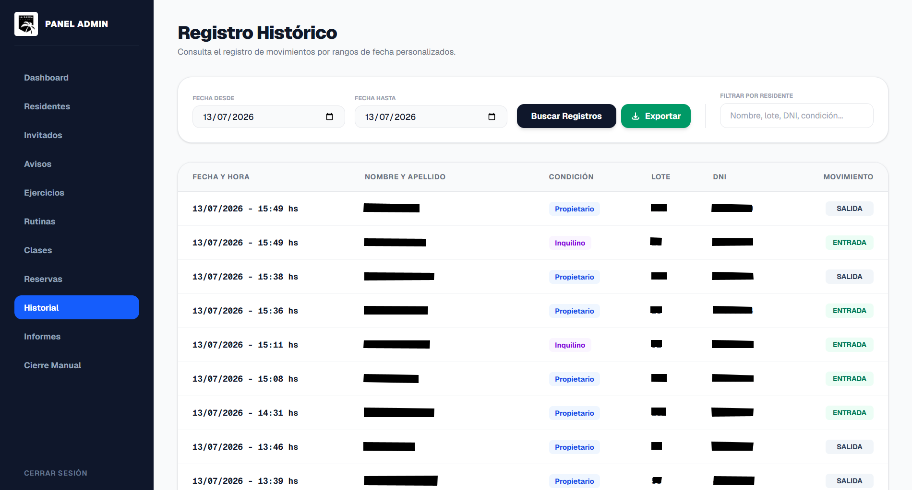
    </td>
  </tr>
  <tr>
    <td>
      
<b>Gestión y Planificación de Clases Semanales</b>

      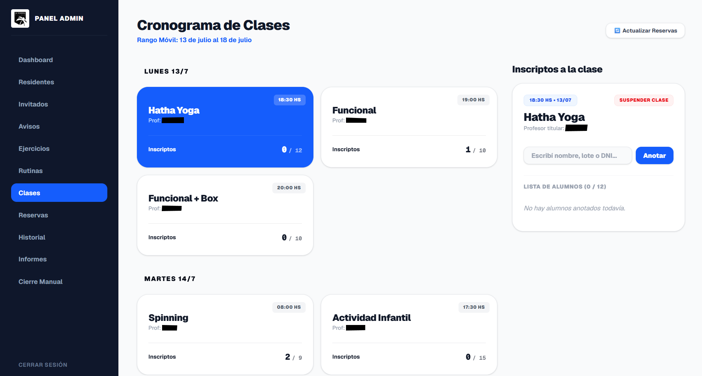
    </td>
    <td>
      
<b>Asignación Digital de Ejercicios y Rutinas</b>

      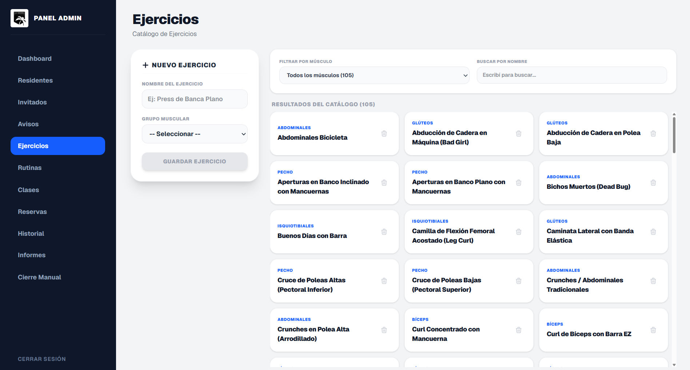
    </td>
  </tr>
</table>
